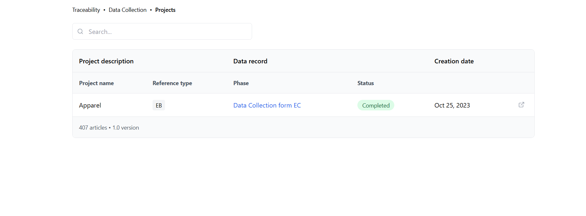

# Bcome Test

A React + TypeScript application for managing project traceability and data collection.



## 🚀 Features

- Project tracking and management
- Data collection form integration
- Search functionality
- Status tracking with visual indicators
- Clean and modern UI design

## 🛠 Technology Stack

- React 18+
- TypeScript
- Tailwind CSS
- Vite
- Lucide React Icons

## 📦 Installation

1. Clone the repository:
```bash
git clone https://github.com/tomifer10/Bcome-test.git
cd bcome-test
```

2. Install dependencies:
```bash
npm install
```

3. Install required development dependencies:
```bash
npm install -D tailwindcss postcss autoprefixer
npm install lucide-react
```

4. Initialize Tailwind CSS:
```bash
npx tailwindcss init -p
```

5. Configure Tailwind CSS by updating `tailwind.config.js`:
```javascript
/** @type {import('tailwindcss').Config} */
export default {
  content: [
    "./index.html",
    "./src/**/*.{js,ts,jsx,tsx}",
  ],
  theme: {
    extend: {},
  },
  plugins: [],
}
```

6. Add Tailwind directives to your CSS (`src/index.css` or `src/App.css`):
```css
@import 'tailwindcss/base';
@import 'tailwindcss/components';
@import 'tailwindcss/utilities';
```

## 🚀 Running the Project

1. Start the development server:
```bash
npm run dev
```

2. Open your browser and navigate to:
```
http://localhost:5173
```

## 📁 Project Structure

```
src/
  ├── components/
  │   └── ProjectTable.tsx
  ├── App.tsx
  ├── App.css
  ├── index.css
  └── main.tsx
```

## 🔧 Configuration

### PostCSS Configuration
Create a `postcss.config.js` file in the root directory:
```javascript
export default {
  plugins: {
    tailwindcss: {},
    autoprefixer: {},
  },
}
```

### VS Code Settings (Optional)
For better development experience, add these settings to your VS Code:
```json
{
  "css.validate": false,
  "tailwindCSS.includeLanguages": {
    "javascript": "javascript",
    "html": "HTML"
  },
  "editor.quickSuggestions": {
    "strings": true
  }
}
```


 project is licensed under the MIT License - see the [LICENSE](LICENSE) file for details.


Made with ❤️ by Tomas Fernandez